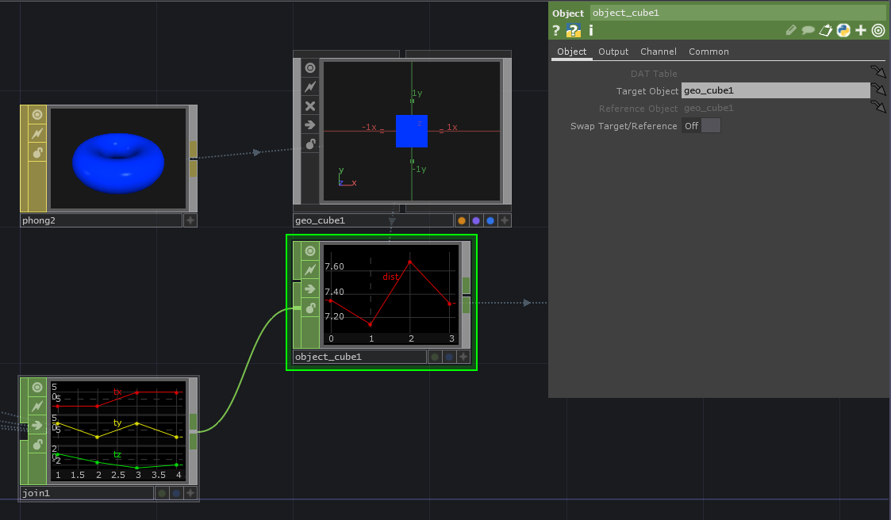
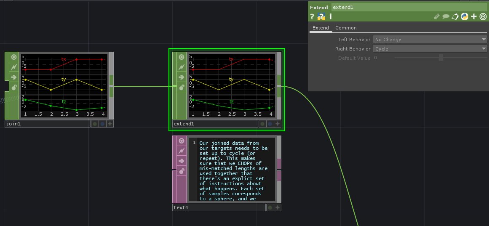

# The Object CHOP

The Object CHOP has long been one of the most challenging CHOPs for me to really wrap my head around. Following along with some conversations on the Facebook Help Group 1, it’s clear that I’m not the only one who has bumped their head against how to take advantage of this operator.

With that in mind, here are a few tricks and techniques that you might find helpful when working with the object CHOP.

## Distance Between Many Objects Part 1

At first glance, it seems like the object CHOP can only perform calculations between single objects, but in fact you can use this operator to perform calculations between many objects provided that you format the input data correctly, and set up your object CHOP to account for multiple samples.

In a first example let’s say that we want to find the distance between several green spheres and a blue box:

First let’s collect our position information. I’ve used an object CHOP per sphere to find its distance, but you might also use a script CHOP, or a put positions in a table that you reference for the spheres, or drive them with custom parameters. How you position them doesn’t matter. What we need, however, is a single CHOP with three channels that hold the transformation information of those spheres. My trick in this network is to use object CHOPs to find their positions, then put them in sequence with a join CHOP:

Next we can use a single object CHOP that’s fed reference positions from this join CHOP, and a target Geometry COMP:

Other important pieces here are the start and end parameters on the channel page.

This is where we set how many samples the object CHOP will evaluate. This can be a bit confusing - here especially as the join CHOP has started at a sample index of 1 rather than 0. The devil is in the details, so it’s worth keeping a close eye for these kinds of oddities. Because of this we compensate in our start position by moving back one sample index.

Next make sure to set your object CHOP to output measurements, and distance. What you’ll then end up with is a single channel with a sample for each distance between your box and spheres. We can convert this to a table if we wanted to see the actual values:

## Distance Between Many Objects Part 2

We may also want to measure distances between multiple blue boxes. Say, for example, that we had two different blue boxes and we wanted to know the distances of our spheres to both of those boxes?

Similar to our first exercise we’ll start by collecting all of the position information for our spheres. We also need position information for our boxes. In this case, however, we need to stretch a single sample to be 4 samples long - this is part of our data preparation step to ensure we correctly calculate distance.

Here a simple stretch CHOP has been used to make sure we have four samples of data for each box. Next we can join this data so all of our box position information is in a single set of CHOP channels:

Before moving on, we need to take a moment to adjust our sphere position data. In our first example we only collected the four positions… we need to set up the correct extend behavior for this series so that our CHOPs know what values to use when CHOPs of mismatched lengths are combined. We can use an extend CHOP set to cycle to do this trick:

Finally, we can then use an object CHOP to calculate the distance between our box and our spheres:

## Distance Between Many Objects plus Bearing

If we also calculate the bearing between our boxes and spheres, we’ll end up with rotation information… what can we do with this? We could use this to calculate the correct rotation for a set of instances. For example:

Here each line is correctly rotated, scaled, and placed based on calculations from the object CHOP.

## Bearing

You can also use the object CHOP to just calculate bearing - or rotation from one object to another. Here you can see how this might be used to rotate instances to sit flat on a sphere’s surface, or rotate an arrow to point towards an object:

## Bearing and Distance

Or you might use the combination of bearing and distance to make some strange abstract art:

## Collision

You can also use the object CHOP to simulate a kind of collision calculation where the distance you’re measuring can help you tell how close an object is to another and if they’re on top of one another:

